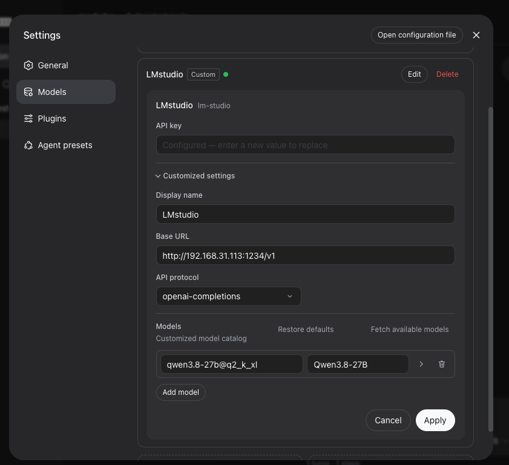
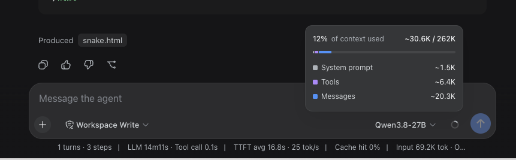

# local-llm-snake-bench

A one-prompt, objectively-scored coding test for locally-hosted LLMs — plus a full
writeup of one run.

**Setup under test:** `Qwen3.8-27B-UD-Q2_K_XL` served by **LM Studio** on a Radeon
RX 9070 XT, driven across the LAN from a Mac through **[DeepSeek Harness](https://github.com/deepseek-ai/deepseek-harness)**.

**Task:** one self-contained HTML file implementing Snake, against 13 numbered
requirements. Four of them are deliberate traps that naive implementations fail silently.

**Result: 13/13 requirements met, 181 of a permitted 250 lines, 15/15 automated checks
passed, no correctness bugs found.** One turn, no retries, no follow-up prompts.

The prompt was written by **Claude Opus 5**, and Opus 5 also reviewed the resulting code
and wrote the automated verifier. The local model wrote only [`snake.html`](snake.html) —
committed here byte-for-byte as it was produced.

| | |
|---|---|
| Prompt | [`PROMPT.md`](PROMPT.md) |
| Model output, unmodified | [`snake.html`](snake.html) |
| Automated verifier | [`verify.js`](verify.js) — `node verify.js` |
| Code review | [`REVIEW.md`](REVIEW.md) |

---

## Why this test exists

"Vibe-checking" a local model by asking it for a snake game tells you almost nothing,
because you end up grading a screenshot. The interesting question is not *does it look
like Snake* but *does it get the parts right that are invisible until they bite you*:
frame-rate-independent timing, input validated against the committed state rather than
the pending one, food placement that terminates on a full board, self-collision that
accounts for the tail vacating its cell.

So the prompt is 13 numbered requirements, each one individually checkable, and
[`verify.js`](verify.js) checks 13 of them mechanically. No screenshots, no vibes.

## Hardware

The model host is a Windows desktop; the agent client is a Mac on the same LAN.

| | |
|---|---|
| GPU | AMD Radeon RX 9070 XT, 16 GB VRAM |
| RAM | 32 GB DDR5-6000 |
| OS | Windows |
| Inference server | LM Studio, OpenAI-compatible endpoint on port 1234 |
| Client | macOS, DeepSeek Harness (`dsh`) |

## Model

| | |
|---|---|
| Repository | `unsloth/Qwen3.8-27B-GGUF` |
| File | `Qwen3.8-27B-UD-Q2_K_XL.gguf` |
| Format | GGUF |
| Quantization | `Q2_K_XL` (Unsloth Dynamic) |
| Architecture | `qwen35`, MTP |
| Capabilities | Vision, Tool use, Reasoning |
| Size on disk | 11.60 GB |
| API model identifier | `qwen3.8-27b@q2_k_xl` |
| Loaded context (this run) | **128,000 tokens** |
| Model max context | 262,144 tokens |

The "UD" matters. `UD-Q2_K_XL` is Unsloth Dynamic quantization, which assigns different
bit widths per layer rather than squashing everything uniformly to 2 bits, keeping the
layers that carry the most signal closer to full precision. The nominal "Q2" undersells
what this file actually is, and it is the most plausible explanation for the results
below.

### Context vs. VRAM on a 16 GB card

The weights are 11.60 GB, so on a 16 GB card the KV cache is what decides whether the whole
working set stays resident — and the KV cache grows linearly with the context window. That
turns context length into a direct trade against generation speed.

Measured on this machine. Same model, same quantization, same prompt style; only the
context window changed:

| Context window | Throughput | GPU | System RAM (of 32 GB) |
|---|---|---|---|
| 64K | **38 tok/s** | 90% | 75% |
| 128K — the documented run | **25 tok/s** | 100% | 92% |

**Halving the context bought 52% more throughput.** At 128K both the card and system
memory are pinned near their limits, so part of every forward pass has to be served from
DDR5 across PCIe instead of from VRAM. At 64K there is headroom on both, and the model
stops paying that toll on every token.

This is also why the documented run shows a **16.8 s time to first token**. Neither that
nor the 25 tok/s is a property of the model — both are the cost of running a 128K window
on a card that cannot hold it.

The practical reading: on a VRAM-constrained card, context length is not a free parameter
you set to the largest value that loads. Size the window to the work. A coding agent that
compacts its own history rarely needs 128K, and 64K here is both meaningfully faster and
comfortably enough — this entire run peaked at ~30.6K tokens of context.

If you do need a large window, enable **K/V Cache Quantization (Q8_0)** in LM Studio's
model load settings. It roughly halves the KV cache for a negligible quality cost, and it
requires Flash Attention to be enabled in the same panel. If something misbehaves,
`K=Q8_0, V=F16` is the safer intermediate — the V cache is more sensitive to quantization
than the K cache.

## DeepSeek Harness

`dsh` is DeepSeek AI's open-source agent harness, built on the Cordis framework around an
architecture where "everything is a plugin". MIT licensed, TypeScript, currently a
developer preview. It ships a web UI and speaks to any OpenAI-compatible endpoint, which
is what makes an LM Studio box on the LAN usable as a drop-in backend.

```bash
npx @deepseek-ai/dsh web
```

The UI comes up on `http://127.0.0.1:3080`.

### Provider configuration

Settings → Models → add a custom provider:

| Field | Value |
|---|---|
| Display name | `LMstudio` |
| Base URL | `http://<lm-studio-host>:1234/v1` |
| API protocol | `openai-completions` |
| API key | any non-empty string (LM Studio ignores it) |
| Model ID | `qwen3.8-27b@q2_k_xl` |
| Model label | `Qwen3.8-27B` |



The model ID has to match what the server reports **exactly**, `@quantization` suffix and
all. Check it with:

```bash
curl -s http://<lm-studio-host>:1234/v1/models | grep '"id"'
```

## Getting the two machines to talk

This was the only part of the setup that actually broke, and the error the client shows is
just "connection error", so here is the checklist in the order worth trying.

**1. LM Studio must be serving on the network, not just on localhost.** In LM Studio's
Developer tab, the server has to be Running *and* **Serve on Local Network** enabled.
This is off by default, and with it off the port is only reachable from the host itself.

**2. The Windows firewall must allow inbound TCP on the port.** Defender will silently
drop connections from other machines on the LAN until an inbound rule exists for 1234.

**3. Verify from the client before touching the client's config.** Three commands, in
increasing order of specificity:

```bash
ping <lm-studio-host>                                    # is the host up
nc -z -v <lm-studio-host> 1234                           # is the port open
curl -s http://<lm-studio-host>:1234/v1/models           # is the API answering
```

If `curl` returns a model list, the network is fine and the problem is in the client
config — almost always the model ID or a Base URL missing its `/v1` suffix.

**4. Then check that the model actually answers.** LM Studio exposes a REST API alongside
the OpenAI-compatible one that reports load state and the real context window:

```bash
curl -s "http://<lm-studio-host>:1234/api/v0/models/qwen3.8-27b@q2_k_xl"
```

```json
{
  "id": "qwen3.8-27b@q2_k_xl",
  "type": "vlm",
  "arch": "qwen35",
  "quantization": "Q2_K_XL",
  "state": "loaded",
  "max_context_length": 262144,
  "loaded_context_length": 128000,
  "capabilities": ["tool_use"]
}
```

`loaded_context_length` is the one worth reading. It is the window LM Studio actually
allocated, as opposed to `max_context_length`, which is only what the model declares it
could support. Clients generally show you the latter.

## The run

One user message, [the prompt](PROMPT.md). No follow-ups, no retries, no clarifying
questions.



| Metric | Value |
|---|---|
| Turns / steps | 1 turn, 3 steps |
| LLM time | 14m 11s |
| Tool call time | 0.1s |
| TTFT (avg) | 16.8 s |
| Throughput | 25 tok/s |
| Prompt cache hit | 0% |
| Input tokens | 69.2K (cumulative across steps) |
| Context used | ~30.6K — system prompt ~1.5K, tools ~6.4K, messages ~20.3K |
| Context window | 128K (loaded in LM Studio) |
| GPU during the run | 100% VRAM utilization |
| System RAM during the run | 92% of 32 GB |
| Agent mode | Workspace Write |
| Produced | `snake.html`, 181 lines |

> **Note on the 262K in that screenshot.** The harness reads the model's declared
> `max_context_length` (262,144) and reports the run as using 12% of it. The window LM
> Studio actually loaded was 128,000 tokens, so the real figure is ~24%. The harness has no
> way to know the difference — overflow past the real window is handled on the LM Studio
> side, not warned about in the UI. Worth knowing before you trust that progress bar on a
> long session.

## Verification

```bash
node verify.js              # or: node verify.js path/to/your-model-output.html
```

`verify.js` pulls the inline `<script>` out of the HTML and runs it against a stubbed
canvas, `localStorage` and `requestAnimationFrame`, then drives it with a controlled clock
and synthetic key events. Game state is reconstructed from the draw calls, so it needs no
cooperation from the code under test. A seeded PRNG replaces `Math.random`, so runs are
reproducible. A greedy food-seeking autopilot exercises the eating, growth and speed-ramp
paths that idle play never reaches.

```
PASS  req 11  frame-rate independence (30-240fps)          head x = 23, 23, 23, 23, 23, 23 after 1060ms
PASS  req 3   reversal blocked (Up then Left in one tick)  head = (15,14), expected (15,14)
PASS  req 3   reversal blocked after turning               y went 13 -> 12 (kept heading up)
PASS  req 4   food never overlaps the body                 0 violations over 40 seeds, 14 distinct spawn cells
PASS  req 7   pause freezes the snake                      (17,15) -> (17,15)
PASS  req 7   PAUSED overlay drawn                         Score: 0 | Best: 0 | PAUSED
PASS  req 7   Space resumes, swallowed input not replayed  resumed at (18,15), still heading right
PASS  req 6   wall collision ends the game                 Score: 0 | Best: 0 | GAME OVER - press R to restart
PASS  req 6   R restarts to length 3 at the centre         len=3, head=(15,15)
PASS  req 12  preventDefault scoped to arrows + space      ArrowUp, ArrowDown, ArrowLeft, ArrowRight, Space
PASS  req 5   length == 3 + food eaten                     len=20, food eaten=17
PASS  req 5   score == 10 x food eaten                     score=170, food eaten=17
PASS  req 9   speed ramps up as food is eaten              tick interval 125ms -> 108ms over 17 food
PASS  req 8   high score written to localStorage           {"snakeHighScore":"170"}
PASS  req 8   high score read back on load                 Best: 420

15/15 checks passed
```

Requirement 13 (a clean browser console) and requirement 1's visual centering are the two
that still need a human to open the file.

## Review summary

Full writeup in [`REVIEW.md`](REVIEW.md). No correctness bugs. Five things worth
improving, in order:

1. **Single-slot direction buffer drops queued input.** Moving right, a fast Down-then-Left
   loses the Left, because it is validated against a direction that has not been committed
   yet. A two-slot queue fixes it.
2. **No `devicePixelRatio` scaling** — soft rendering on every HiDPI display.
3. **The difficulty curve is nearly flat.** The prompt's fault, not the model's: 5%
   compounding every 5th food means the 20 moves/s cap needs 95 food to reach.
4. **A backgrounded tab keeps playing** — one `visibilitychange` listener away from fixed.
5. **Fixed 600px layout overflows small viewports.**

Notable in the other direction: the model added a 250ms delta clamp that the prompt never
asked for, which prevents the accumulator from replaying a backgrounded gap as a burst of
instant moves. And it got the tail-vacates-its-cell rule in the self-collision check
right — the single most commonly botched line in a Snake implementation.

## Reproduce this with your own model

1. Load a model in LM Studio, enable **Serve on Local Network**, note the API model
   identifier.
2. Point any OpenAI-compatible agent client at `http://<host>:1234/v1`.
3. Send [`PROMPT.md`](PROMPT.md)'s fenced block as a single message, unedited.
4. Save the output as `out.html` and run `node verify.js out.html`.

Only requirement 13 and the visual check need eyes. Everything else is a number.

PRs adding results for other models are welcome — model, quantization, hardware, score.

---

## Türkçe özet

Lokalde çalışan bir modeli "bir yılan oyunu yaz" deyip ekran görüntüsüne bakarak
değerlendirmek işe yaramıyor; sonuçta bir kanı elde ediyorsunuz, ölçüm değil. Bu repo
onun yerine **13 maddelik, her maddesi tek tek doğrulanabilir bir prompt** ve çıktıyı
otomatik puanlayan bir doğrulayıcı içeriyor.

Test edilen kurulum: **Qwen3.8-27B-UD-Q2_K_XL**, Windows bir makinede LM Studio ile
sunuluyor (RX 9070 XT 16 GB VRAM, 32 GB DDR5-6000), ağ üzerinden Mac'ten **DeepSeek
Harness** ile sürülüyor.

**Sonuç: 13/13 madde karşılandı, 181 satır (sınır 250), 15/15 otomatik test geçti, hiçbir
doğruluk hatası bulunamadı.** Tek turda, tekrar denemeden, ek soru sormadan.

Prompt'u ve otomatik doğrulayıcıyı **Claude Opus 5** yazdı, kod incelemesini de o yaptı.
Lokal model yalnızca [`snake.html`](snake.html) dosyasını üretti — dosya burada
üretildiği haliyle, tek karakteri değiştirilmeden duruyor.

İşin en öğretici kısmı, modelin dört "tuzak" maddeyi de doğru çözmesiydi: ekran
yenileme hızından bağımsız sabit zaman adımı, ters dönmenin gerçekten imkânsız olması,
yem yerleştirmenin dolu tahtada da sonlanması ve kendine çarpma kontrolünde kuyruğun o tur
boşalacak hücresinin hariç tutulması. Bu son madde, Snake implementasyonlarında en sık
yanlış yazılan satırdır.

Bunun teknik açıklaması büyük ihtimalle kuantizasyonun kendisi: `UD-Q2_K_XL`, katmanları
tek tip 2-bit'e indirmek yerine katman başına farklı bit genişlikleri atayan Unsloth
Dynamic kuantizasyonu. "Q2" etiketi bu dosyayı hak ettiğinden daha kötü gösteriyor.

Yan bulgu — 16 GB'lık bir kartta context uzunluğu bedava bir parametre değil. Aynı makinede,
aynı modelle, yalnızca context penceresini değiştirerek:

| Context | Hız | GPU | Sistem RAM (32 GB'ın) |
|---|---|---|---|
| 64K | **38 tok/s** | %90 | %75 |
| 128K (bu run) | **25 tok/s** | %100 | %92 |

Context'i yarıya indirmek hızı **%52 artırdı**. 128K'da hem kart hem sistem belleği
sınırda; modelin bir kısmı VRAM yerine PCIe üzerinden DDR5'ten besleniyor ve bu bedel her
token'da ödeniyor. Pencereyi işin boyutuna göre seçmek gerekiyor: bu run'ın tamamı zaten
~30.6K token'da kaldı.

## License

MIT — see [LICENSE](LICENSE).

`snake.html` is model-generated output, included verbatim as the artifact under test.
